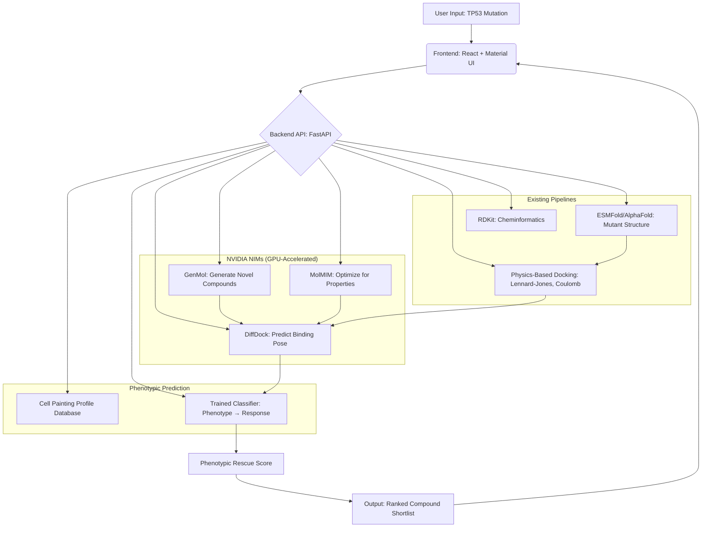

# PhenoRescue AI

PhenoRescue AI is a multi-modal artificial intelligence platform designed to accelerate phenotypic drug discovery for TP53 cancer mutations. By integrating cutting-edge generative AI models from NVIDIA with structural biology and high-content imaging data, PhenoRescue AI moves beyond traditional structure-based docking to predict a compound's ability to restore healthy cellular function.

---

## 🚀 Overview & Key Features

This platform provides a comprehensive approach to identifying and prioritizing therapeutic candidates for specific TP53 mutations:

*   **Multi-Modal Prediction:** Predicts compound efficacy by combining:
    *   **Structural Layer:** Assesses if a compound physically binds to the mutated p53 protein.
    *   **Phenotypic Layer:** Predicts the cellular consequences of binding by analyzing high-content imaging data (Cell Painting) to identify "rescued" cellular phenotypes.
*   **Unified Dashboard:** A web-based interface for:
    *   Inputting TP53 mutations.
    *   Visualizing mutant protein structures.
    *   Viewing a ranked list of compounds with combined structural and phenotypic scores.
    *   Displaying predicted morphological profiles of rescued cells.
*   **Novel Compound Generation:** Utilizes generative chemistry models to design and synthesize novel molecules tailored to rescue specific phenotypes.
*   **Actionable Prioritization:** Delivers a prioritized shortlist of compounds supported by both structural binding evidence and predicted phenotypic rescue, guiding experimental validation.
*   **"TechBio" Approach:** Focuses on the complex interplay between molecular interactions and cellular biology, offering a more holistic view of drug efficacy.

---

## 🛠️ Technology Stack

PhenoRescue AI leverages a robust blend of state-of-the-art AI, scientific computing, and web technologies.

### Data Sources

*   **TP53 Variant Annotations:** NCI TP53 Database, IARC TP53 Database.
*   **CRISPR Gene Effect Scores:** DepMap Portal (`Achilles_gene_effect_CERES.csv`).
*   **Cell Painting Morphological Profiles:** JUMP Cell Painting Consortium dataset (AWS S3 bucket `s3://cellpainting-gallery/cpg0016-jump/`).
*   **Cell Line Metadata:** DepMap (`model_list.csv`).

### NVIDIA Models (Core AI Engine)

PhenoRescue AI integrates powerful NVIDIA generative AI models:

*   **GenMol (Generative Chemistry):** Used for de-novo generation of novel chemical scaffolds and fragment-based molecule generation.
*   **MolMIM (Controlled Generation):** Optimizes generated molecules for specific desired properties (e.g., binding affinity, solubility).
*   **DiffDock (Molecular Docking):** Predicts 3D protein-ligand binding poses, including an "All-atom DiffDock Pocket" for detailed structural analysis.

### NVIDIA BioNeMo Platform (Orchestration)

The BioNeMo platform provides the underlying infrastructure for integrating and deploying the NVIDIA models:

*   **NVIDIA NIMs:** Optimized, deployable microservices for GenMol, MolMIM, and DiffDock.
*   **BioNeMo Agent Toolkit:** Facilitates the creation of AI agents to automate complex workflows, from compound generation and docking to phenotypic prediction and reporting.

### General Tech Stack

*   **Backend:** Python, FastAPI, Docker
*   **Frontend:** TypeScript, React, Material UI
*   **ML Frameworks:** PyTorch, Scikit-learn, XGBoost
*   **Scientific Computing:** RDKit, ESMFold, AlphaFold
*   **Data Management:** Firebase, Supabase

---

## 🏗️ Architecture

The platform is designed with a modular architecture, allowing for flexible component integration and refinement.

